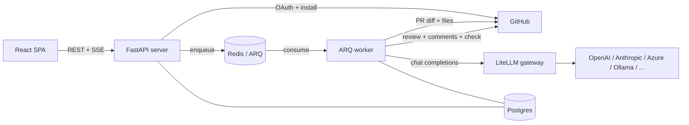

# slopolis — Self-Hostable GitHub PR Review Agent

> An app-triggered PR review service: pick one or more pull requests, add a prompt, and get structured review findings posted to GitHub and viewable in a web app.

**Spec version:** 2.0
**Status:** MVP (Phase 1) approved; later phases scoped
**Last updated:** 2026-09-10
**Deployment:** Self-hosted first; multi-tenant hosted mode later

---

## 1. Overview

slopolis reviews pull requests. The first product surface is a **web application** where an authenticated user submits a review session — one or more PR links plus an optional prompt — and the system runs the review, posts results to GitHub, and shows everything in the app.

Later phases add a **mentionable GitHub bot** (`@slopolis review`), **agent orchestration** (orchestrator → per-PR managers → sub-agents), a codebase-aware **chat mode**, and extensibility features.

### The MVP in one line

> Submit PR links + a prompt from the app; the infrastructure validates, queues, executes, and publishes the review — with no orchestration yet.

---

## 2. Goals and Non-Goals

### Goals
1. Trigger reviews from the app by pasting one or more PR URLs plus an optional prompt.
2. Run reviews on a queue + worker pool, with per-PR parallelism, cancellation, and retries.
3. Configure provider credentials and assign models in the workspace; validate everything before a run.
4. Post structured findings to GitHub (review, inline comments, check run) and render them in the app.
5. Keep every session available at a permalink with history and live progress.
6. Track tokens and cost.
7. Be fully self-hostable with Docker Compose.

### Non-Goals (Phase 1)
- GitHub-comment triggers (`@slopolis review`) — Phase 2.
- Agent orchestration and sub-agents — Phase 3.
- Codebase-aware chat mode — Phase 4.
- Budget enforcement (tracking only in Phase 1).
- Additional SCMs, rule packs/plugins, multi-tenancy.
- Auto-merge, code generation, model fine-tuning.

---

## 3. Global Locked Decisions

| Decision | Choice |
|---|---|
| GitHub integration | Single **GitHub App** (user-to-server OAuth for login + installation tokens for repo actions) |
| Backend | **Python + FastAPI** (async) |
| Frontend | **React + Vite + TypeScript SPA** (no Next.js) |
| UI system | **Tailwind + shadcn/ui** |
| Worker | **ARQ** on Redis |
| Database / ORM | **Postgres + SQLAlchemy 2.0 (async) + Alembic** |
| Validation / settings | **Pydantic v2** |
| GitHub client | **githubkit** (async, typed) |
| Model gateway | **LiteLLM**, plus any **OpenAI-compatible** endpoint |
| Tenancy | **Self-host first (single tenant)**, multi-tenant later |
| Tooling | **uv**, **ruff**, **basedpyright** (strict), **pytest** |
| Bot handle | `@slopolis` |
| Deployment | **Docker Compose** now, Helm later |

---

## 4. Configuration Model (three layers)

A deliberate three-layer split keeps secrets and cost control out of repositories, including public ones.

| Layer | Where | Holds |
|---|---|---|
| **Repo** | `.codereview.yml` committed in the repo | Review behavior: severity threshold, ignores, instructions, output toggles. Later: which agents to spawn. **Never models, never keys.** |
| **Workspace** | The hosting app (server-side) | Provider credentials (encrypted vault), model catalog, **agent → model assignment**, public-repo policy, stopgap caps, usage. |
| **Gateway** | LiteLLM / OpenAI-compatible endpoints | Actual provider calls. |

Key consequences:
- A repo config can only express **intent**; it cannot reference a credential or leak a key.
- **Agents are pinned to models at the workspace level**, not in the repo.
- On a public repo, the committed config can never cause someone else's key to be used.

---

## 5. Personas and Tenancy

- **Triggering user** — any authenticated user with the required GitHub access to the target repo(s).
- **Workspace admin** — manages provider credentials, model assignments, policy, and caps.
- **Repository maintainer** — authors `.codereview.yml`.

v1 is **single-tenant** (one self-hosted deployment = one workspace). A default `Workspace` row exists and all queries are workspace-scoped, so multi-tenancy is a later migration rather than a rewrite.

---

## 6. System Architecture

### Components
- **SPA (`apps/web`)** — React app; talks to the API over HTTPS (REST + SSE).
- **Server (`apps/server`)** — FastAPI: auth, GitHub App, provider/model management, session creation, pre-flight, SSE, usage.
- **Worker (`apps/worker`)** — ARQ consumers: run review targets, call LiteLLM, publish to GitHub.
- **Postgres** — system of record.
- **Redis** — ARQ broker/result backend.
- **LiteLLM gateway** — OpenAI-compatible front for providers.

### Diagram


### Primary flow
1. User signs in with GitHub; the workspace has provider credentials and model assignments configured.
2. User opens the session form, pastes PR URLs, optionally writes a prompt, and submits.
3. **Pre-flight** validates synchronously; on failure nothing is created and the user is notified.
4. On success a `ReviewSession` is created and one sub-job per PR target is enqueued.
5. Workers run each target in parallel: collect context, call the model, parse findings.
6. Results are published to GitHub and rendered in the app; usage is recorded.
7. The session page streams progress via SSE and remains available afterward.

---

## 7. Tech Stack

| Layer | Choice |
|---|---|
| Frontend | React + Vite + TypeScript, TanStack Query/Router, Tailwind, shadcn/ui |
| Web tooling | Bun (package manager + dev/build runner); Vitest run via Bun |
| Backend | FastAPI + Uvicorn/Granian |
| Worker | ARQ (Redis) |
| DB / migrations | Postgres + SQLAlchemy 2.0 async + Alembic |
| Validation | Pydantic v2 / pydantic-settings |
| HTTP | httpx (async) |
| GitHub | githubkit |
| Model gateway | LiteLLM + OpenAI-compatible |
| API contract | FastAPI OpenAPI → generated TS client |
| Tooling | uv, ruff, basedpyright (strict), pytest |

---

## 8. Repository Layout

```
apps/
  web/        # React + Vite SPA
  server/     # FastAPI: API, GitHub App, pre-flight, SSE, usage
  worker/     # ARQ consumers: run targets, publish
packages/
  core/       # review harness, prompts, config schema, GitHub + LLM clients
  db/         # SQLAlchemy models + Alembic migrations
  ui/         # shared shadcn components
infra/
  docker-compose.yml
  caddy/
  litellm/
```

---

## 9. Domain Model

```
Workspace
 ├─ Users
 ├─ GitHubInstallation ──< Repositories
 ├─ ProviderCredential      (encrypted key + base URL)
 ├─ ModelCatalog            (per credential; imported + manual)
 ├─ ModelAssignment         (agent role -> model; `auto` allowed)
 ├─ ReviewSession           (prompt, name, status, permalink)
 │   ├─ SessionTarget       (one PR)
 │   │   ├─ SessionTargetRun (attempts/status/tokens/cost)
 │   │   └─ Finding
 │   └─ UsageRecord
 ├─ AuditLog
 └─ (later) AgentDefinition, RulePack
```

- **ReviewSession** — one submission; has a permalink, an optional prompt, N targets, aggregated results.
- **SessionTarget** — one PR within a session; runs, retries, and findings hang off it.
- **Finding** — `path`, `line`, `severity`, `category`, `message`, `suggestion`, `confidence`.
- **ModelAssignment** — workspace-level mapping from agent role (in MVP, a single built-in review role) to a model; `auto` resolves to the workspace default.

---

## 11. In-Repo Configuration (Phase 1 subset)

Location: `.codereview.yml` (then `.github/codereview.yml`). Validated with Pydantic v2. Invalid config fails pre-flight. Unknown keys warn but do not fail.

```yaml
version: 1
enabled: true

review:
  severity_threshold: warning      # minimum severity to post
  max_files: 50
  max_diff_lines: 20000
  ignore:
    paths: ["**/*.lock", "dist/**", "**/*.min.js", "vendor/**"]
  instructions: |
    Follow our house style. Flag N+1 queries. No personal-taste nits.

output:
  inline_comments: true
  summary_comment: true
  check_run: true
  suggestions: true
  fail_check_on: error             # check conclusion threshold
```

**Deliberately absent (by design):** model names and credentials. Those live in the workspace. 

**Planned for later phases (documented intent, not implemented in Phase 1):**
- `triggers.*` — mention and auto-trigger configuration (Phase 2).
- An orchestration definition describing which agents to spawn, kept out of `.codereview.yml` to avoid bloat, e.g.:
  ```
  .codereview/
    config.yml        # small settings file
    agents/           # one file per agent definition
      security.yml
      tests.yml
      integration.yml
  ```
  The exact format is finalized in the orchestration phase.

---

## 12. Security

- GitHub App private key and webhook secret held server-side only.
- Provider credentials encrypted with envelope encryption; plaintext never logged; UI shows only the last four characters.
- Webhook signature verification (when webhooks arrive in Phase 2); installation tokens for repo actions.
- Triggering permission enforced via GitHub (write on public, read on private).
- Session content gated by repo access; raw model/tool payloads restricted to authorized viewers.
- RBAC: owner / admin / member; only admins manage credentials and model assignments.
- Audit log for credential, model-assignment, policy, and cap changes.

---

## 13. Self-Hosting and Deployment

`docker-compose.yml` services: `web` (static SPA via Caddy), `server`, `worker`, `postgres`, `redis`, `litellm`. Configuration via `.env`:
`GITHUB_APP_ID`, `GITHUB_APP_PRIVATE_KEY`, `GITHUB_WEBHOOK_SECRET`, `GITHUB_CLIENT_ID`, `GITHUB_CLIENT_SECRET`, `APP_URL`, `DATABASE_URL`, `REDIS_URL`, `ENCRYPTION_KEY`, `LITELLM_BASE_URL`, `LITELLM_MASTER_KEY`.

One-command bootstrap; Alembic migrations run on server start.

---

## 14. Observability and Operations

- Structured JSON logs with correlation IDs.
- Metrics: queue depth, session/job duration, tokens, cost, error rate, SSE connections.
- Health/readiness endpoints per service.
- Alerts on queue backlog and repeated model failures.

---

## 15. Testing Strategy

- **Unit** — config parsing, pre-flight logic, prompt composition, JSON finding validation, cost math.
- **Integration** — GitHub API via fixtures, LiteLLM via mocked HTTP (`respx`), queue/worker lifecycle.
- **Contract** — OpenAPI stability; generated TS client compiles.
- **End-to-end** — a sandbox repo with a real GitHub App installation in CI.
- **Frontend** — component tests plus a small Playwright smoke suite.

---

## 16. Non-Functional Requirements

| Attribute | Target |
|---|---|
| Submit latency | Pre-flight check completes quickly; live model check is lightweight |
| Isolation | A failed target never affects other targets, sessions, or the server |
| Concurrency | Parallel per-PR targets, bounded by per-repo/installation/global limits |
| Durability | Queued work survives worker restarts |
| Security | Secrets encrypted; permission checks enforced; least-privilege GitHub access |
| Portability | Fully self-hostable via Docker Compose |

---

## 17. Roadmap

| Phase | Focus |
|---|---|
| **1. App-triggered review MVP** | Account + GitHub App, provider/model config, pre-flight, session form, queue/worker, review harness, publish, history, usage |
| **2. GitHub comment flow** | `@slopolis review` mentions with PR links + prompt, auto-triggers, in-thread session-link replies, one rolling comment |
| **3. Orchestration** | Orchestrator → per-PR managers → sub-agents; agents pinned to workspace models; built-in + custom agent roles; `.codereview/agents/` |
| **4. Chat mode** | Codebase-aware conversation in PR threads |
| **5. Extensibility & scale** | Rule packs/plugins, additional SCMs, multi-tenancy, budgets, Helm/SLOs |

---

## 18. Deferred / Backlog

- **Agent orchestration** — orchestrator reads the session prompt, spawns one PR manager per PR, each able to spawn sub-agents; cross-PR integration validation; recursion bounded with explicit cost budgets. Config in `.codereview/agents/`.
- **Mention flow** — `@slopolis review` + PR links + prompt; current PR plus linked PRs, cross-repo; commenter needs write access on every target repo; every mention creates a new session; the bot replies with the session link.
- **Chat mode** — bare `@slopolis` mention; repo-wide codebase access.
- **Budgets** — enforce per-repo/per-user cost and token caps (Phase 1 only tracks).
- **Inline flags** — `--model`, `--focus`, `--stop` on the mention.
- **Rule packs / plugins**, **additional SCMs**, **multi-tenancy**, **per-repo credential bindings**.

---

## 19. Open Questions

1. Exact model-assignment UX for multiple agent roles (MVP has one built-in role).
2. Orchestration config format and depth/cost-budget defaults.
3. Budget model and enforcement thresholds (later phase).
4. Retention configurability (Phase 1 keeps data indefinitely).
5. Final order of Phases 3–5 (orchestration vs chat priority).

---

## 20. Risks

| Risk | Mitigation |
|---|---|
| Model output not parseable | Strict JSON schema + validation + retries + failure note |
| Public-repo cost abuse | Write-access gate; stopgap caps; budgets later |
| Large repos / context blowup | API-only context with caps; diff-only fallback + note |
| GitHub rate limits | Installation-token caching, backoff, bounded tool calls |
| Secret leakage | Envelope encryption, redaction, RBAC, audit log |
| Noisy reviews | Severity threshold, ignores, one rolling comment |
| Queue backlog | Horizontal worker scaling; backlog metrics/alerts |
