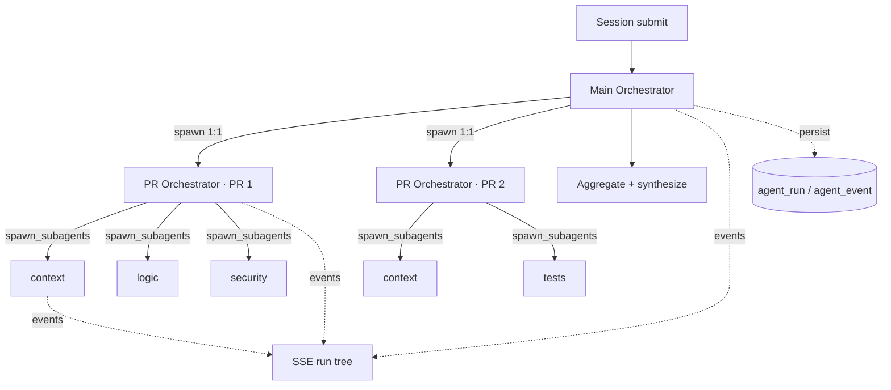

# slopolis — Agent Harness (two versions)

**Spec version:** v2
**Status:** DRAFT for review (extends v1; supersedes nothing)
**Last updated:** 2026-09-23
**Scope:** the agent harness, in two versions

> v1 remains the approved MVP; v1 decisions carry forward unchanged unless explicitly overridden. This version realizes the v1 roadmap item "Phase 3. Orchestration" — but split into a first version we build now and a second version parked for further investigation.

---

## 1. Two versions of the harness

| Version | Name | Status | Shape |
|---|---|---|---|
| **V1** | Hierarchical supervisor with sub-agents | **Build now** | Main orchestrator → per-PR orchestrators → review sub-agents; uniform spawn capability; full visibility |
| **V2** | Magentic orchestration | **Parked — further investigation** | Adds Task/Progress ledgers, deterministic stall→re-plan loop, coverage-based completion |

**Why the split.** V1 answers "let agents delegate and let me see what they're doing" with the least machinery. V2 (the Magentic ledger loop) is a substantial control layer that only pays off once delegation is working and measured. So V1 ships first; the Magentic design is kept as a readiness/reference spec.

---

## 2. Harness V1 in one line

> A session with N PRs fans out into N per-PR orchestrators, each free to spawn the reviewers it needs; every agent, step, and sub-agent is visible in a live run tree.

Locked decisions:

| Decision | Choice |
|---|---|
| Hierarchy | Main (per session) → PR orchestrator (per PR target, 1:1 runtime-enforced) → sub-agents |
| Spawn capability | Uniform tool at levels 0 and 1; depth bounded by policy (`max_depth=2`) |
| Spawn contract | Batch `spawn_subagents([...])` — parallel, bounded, blocking, typed results |
| Control flow | Standard agent tool-loop (no ledgers); deterministic termination by step/time/cost budget |
| Models | Role → workspace `ModelAssignment`; no model names in code or repo config |
| Visibility | Event-sourced run tree; persisted + SSE; live UI (tree + node detail) |
| Safety | Read-only tools during the run; untrusted content marked as data; no side effects until publish |
| Bounds | depth, concurrency, per-run and per-session token/cost/time caps |

Full detail: [features/01-supervisor-subagents.md](./features/01-supervisor-subagents.md).

---

## 3. Architecture (V1)



---

## 4. Relationship to v1

| v1 decision | v2/V1 change |
|---|---|
| 10.6: one agent, single pass, no orchestration | **Changed:** hierarchical orchestrators + sub-agents. Single-pass mode remains the V1.1 bootstrap and the fallback. |
| 10.5: one sub-job per PR target | **Extended:** a target job now runs a PR orchestrator. |
| Workspace `ModelAssignment` | **Unchanged, now load-bearing:** every role resolves its model here. |
| `.codereview.yml` intent-only, never models/keys | **Unchanged.** |
| Advisory posting, no auto-approve | **Unchanged.** |
| Strict structured findings + grounding | **Unchanged.** |

---

## 5. Domain model additions

```
Workspace
 └─ AgentDefinition              (later: workspace-custom agents)
Session
 └─ Main AgentRun
     ├─ PR AgentRun             (target_id set; one per SessionTarget)
     │   └─ Sub AgentRun(s)     (parent_run_id set)
     └─ AgentEvent (per run)
SessionTarget
 └─ Finding (gains agent_run_id)
```

---

## 6. Feature index

| # | Feature | File | Status |
|---|---|---|---|
| 11.1 | Harness V1 — hierarchical supervisor with sub-agents | [features/01-supervisor-subagents.md](./features/01-supervisor-subagents.md) | build now |
| 11.2 | Harness V2 — Magentic orchestration | [features/02-magentic-orchestration.md](./features/02-magentic-orchestration.md) | parked |
| 11.3 | Turn transcripts — the raw request and response of every model call | [features/03-turn-transcripts.md](./features/03-turn-transcripts.md) | build now |

---

## 7. Testing strategy (v2 delta)

- **Unit** — spawn tool, budget accounting, tree assembly, event redaction.
- **Integration** — fake LLMs driving `spawn_subagents`; assert tree shape, concurrency caps, 1:1 enforcement, cancellation.
- **Replay** — reconstruct the run tree from `agent_event`.
- **Quality** — golden-PR set with precision/coverage metrics (closes the v1 §15 gap).
- **E2E** — multi-PR session against a sandbox repo.

---

## 8. Open questions

1. **Event granularity (summary vs full model turns) — resolved.** Both, at two grains: summaries on
   `agent.step`/`agent.message`, the full turn on its own `agent.turn` event
   ([features/03-turn-transcripts.md](./features/03-turn-transcripts.md)).
2. Shared repo-context cache vs isolated sub-agents.
3. Retry semantics for failed sub-agents.
4. Scope of the main orchestrator beyond aggregation (cross-PR synthesis).
5. When (if ever) V2's ledgers become justified — the trigger should be a measured failure mode of V1 (e.g. loops or runaway cost), not a preference.
