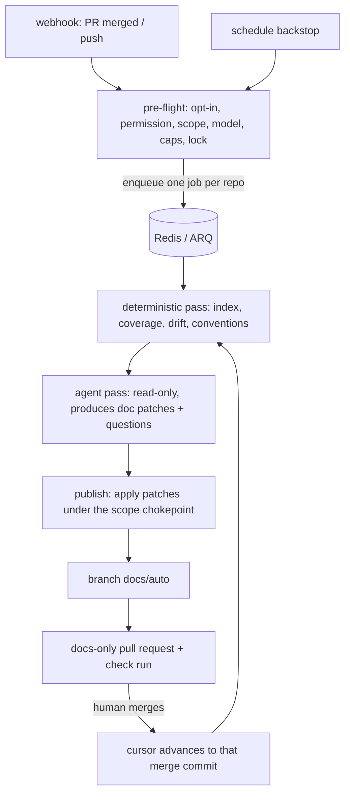

# slopolis — Repository Documentation Agent

**Spec version:** v3
**Status:** DRAFT for review (extends v1; supersedes nothing)
**Last updated:** 2026-09-20
**Scope:** repository-scoped documentation detection and maintenance

> v1 remains the approved MVP. v2 (the agent harness) is a prerequisite for this version's run
> machinery. v1 and v2 decisions carry forward unchanged unless explicitly overridden here.
> This version is sequenced **after the Phase 2 webhook flow**: continuous documentation needs
> merge events, not a form submit.

---

## 1. In one line

> A repository is documented continuously: **coverage and drift are detected on every merge**, an
> agent maintains the documentation in a **docs-only pull request**, and a human merges it.

---

## 2. Why this is its own surface, not another kind of review

| | Reviews (v1) | Documentation (v3) |
|---|---|---|
| Unit of work | A submission (1..N PRs) | A **repository** |
| Trigger | User submits a form | Merge events (+ schedule backstop) |
| Lifetime | One-shot; the session ends | **Continuous**; state survives every run |
| Output | Findings, comments, check run | Findings **and** a branch + pull request |
| Cost shape | Metered per submission | Recurring per repository |

The first row is the whole design consequence: reviews need no state between sessions, so
documentation needs a new **repository-scoped** entity, a new trigger path, and a new publish
mode — while reusing the session → run → usage spine for everything else.

---

## 3. Locked decisions

| Decision | Choice |
|---|---|
| Target kind | A session target may be a **repository + base ref** instead of a pull request |
| State | One **`RepositoryDocsState`** per repository: catalogue digest, index revision, cursor, open docs PR, lock |
| Enablement | **Opt-in per repository, off by default**; enabling and disabling are audited admin actions |
| Permission | **`contents: write` added to the existing GitHub App** (see §7) |
| Write scope | **Docs paths only**, enforced at a single choke point; there is no code-write tool |
| Detection order | **Deterministic first** (index, coverage, drift, conventions); the model writes prose, never facts |
| Trigger | `pull_request` closed+merged on the base ref, `push` to it, plus a scheduled backstop |
| Publish | A **docs-only pull request** on a rolling `docs/auto` branch; a check run on that PR |
| Merge authority | **Never auto-merge.** Docs are proposals; a human holds the merge button |
| Truth direction | Declared links are authoritative; inferred links are suggestions that must be confirmed |
| Feedback loop | `## Questions for the author(s)` in the docs PR is mandatory — the agent recruits intent instead of inventing it |
| Cost | Per-run token budget, cadence limit per repository, and a diff cap that splits by area |

---

## 4. Relationship to v1 and v2

| Prior decision | v3 change |
|---|---|
| 10.4 / 10.5: a session holds one target per PR | **Extended:** a target may be a repository. Same session row, run row, usage attribution, permalink and SSE |
| 10.6: bounded read tools, no clone | **Unchanged, reused as-is** by the detection pass |
| 10.7: rolling comment, inline comments, check run | **New publish mode:** branch + pull request. The check run and severity floor carry over |
| 10.2: stopgap caps (concurrency, sessions/user/day) | **Extended:** caps must also bound *recurring* per-repository work |
| 10.9: usage per model/repo/user/session | **Unchanged;** docs runs are attributed like any other run |
| v1 §11 `.codereview.yml` expresses intent only | **Extended** with a `docs:` block; still no models, no credentials |
| v1 §12 security posture | **Changed in scope, not in kind:** the App now writes to customer repos. Audit + scope enforcement are the new controls |
| v2: read-only tools during a run; no side effects until publish | **Unchanged and load-bearing** — see §6 |
| v2 `AgentRun` / `AgentEvent`, `ModelAssignment` role resolution, budget enforcement | **Reused** by the docs run |

---

## 5. Domain model additions

```
Workspace
 └─ Repository
     └─ RepositoryDocsState          (NEW — survives sessions)
          · catalogue_digest          document set + ids
          · index_revision            code-index revision the catalogue was verified against
          · cursor_commit             merge commit of the last MERGED docs PR
          · open_pr_number            the rolling docs PR, if any
          · locked_by_run_id          one docs run per repository at a time
          · enabled, scope, cadence, budget      (mirrors .codereview.yml, resolved)

ReviewSession
 · kind: review | docs               (NEW)
 └─ SessionTarget                    (PR target | repo target — NEW kind)
     ├─ SessionTargetRun             (unchanged: attempts, status, tokens, cost)
     ├─ Finding                      (unchanged; categories extended)
     └─ AgentRun / AgentEvent        (from v2, unchanged)
```

`Finding.category` gains `drift`, `gap`, `convention`, `doc-written`. This reuse is deliberate:
the app-side rendering of gaps, drift and impact then comes from rows the UI already knows how
to display, and the permalink, SSE stream, run tree and usage screens need no parallel stack.

---

## 6. Architecture



Three properties fall out of this shape:

1. **No side effects until publish.** The agent explores with read-only tools, exactly as v2
   requires; its writes exist as proposed patches until the publish phase applies them. The
   scope chokepoint is in the publish phase, so a prompt-injected repo cannot write at all.
2. **Deterministic facts, model prose.** Coverage, drift and conventions are computed; the model
   explains and writes documentation. This is what keeps the output reviewable on a rerun.
3. **The cursor is derived, never "yesterday".** It is the merge commit of the last *merged*
   docs PR, recomputed from git history. A failed, skipped, or unmerged run therefore loses
   nothing and self-heals on the next trigger.

---

## 7. Permission and migration

- The existing App gains **`contents: write`**. A separate App was rejected: it would double the
  install flows, private keys and token paths for one feature.
- **Existing installations must re-approve** the added permission. This is a one-time migration
  and needs an announcement plus a user-visible state ("docs automation unavailable until the
  permission is approved"), never a silent failure.
- Because enablement is **opt-in per repository**, holding the permission does not mean any
  repository is written to. The opt-in list is the consent record; both enabling and disabling
  are written to `AuditLog`.
- GitHub cannot express "only under `docs/`". The scope is enforced by the application at one
  choke point, and the eval harness must include a test that a code-path write is refused.
- Repositories that decline the permission stay usable in a **degraded mode**: the same run posts
  the documentation patch as a comment instead of a branch. This mode is a fallback, not a
  product surface.

---

## 8. Lifecycle, bounds and idempotency

| Concern | Rule |
|---|---|
| Concurrency | At most one docs run per repository; `RepositoryDocsState.locked_by_run_id` holds the claim |
| Idempotency | A rerun with no new merges performs zero writes; the docs PR is updated, never duplicated |
| Backstop | A scheduled pass covers missed webhooks and docs PRs that sat unmerged |
| Reviewability | A diff cap bounds one PR; exceeding it splits the work by area into multiple runs rather than producing one unreviewable PR |
| Cost | Per-run token budget plus a per-repository cadence limit; both enforced before the run starts and checked between steps |
| Failure | Fail closed: an unreadable repository state means no partial writes, surfaced as a failed run |
| Notification | The docs PR is the notification channel; an optional mention reply arrives with the Phase 2 comment flow |

---

## 9. Feature index

| # | Feature | File | Status |
|---|---|---|---|
| 12.1 | Repository documentation state, coverage and drift | [features/01-repo-docs-state.md](./features/01-repo-docs-state.md) | build after Phase 2 webhooks |
| 12.2 | Documentation agent run and publish | [features/02-docs-agent-runs.md](./features/02-docs-agent-runs.md) | build after Phase 2 webhooks |

12.1 is independently shippable and needs no write permission; 12.2 depends on it.

---

## 10. Testing strategy (v3 delta)

- **Unit** — the scope chokepoint (a path outside `docs.scope` must be refused, including via
  symlink or `..`), cursor computation, `.codereview.yml` `docs:` parsing, drift math.
- **Integration** — fake GitHub for branch/PR creation and permission-denied paths; a fake model
  emitting doc patches; lock contention between two runs; an idempotent rerun asserting zero writes.
- **Safety** — a fixture that attempts a code-path write must be rejected, and a run whose input
  contains injected instructions must not acquire write capability.
- **Contract** — the docs PR body contract and the check-run conclusions.
- **E2E** — a sandbox repository: merge a PR, then assert the docs PR contents and that nothing
  outside the configured scope was modified.

---

## 11. Open questions

1. **Default cadence** and whether the schedule is a v3 feature or an operational setting.
2. **Rolling `docs/auto` branch vs a per-run branch** — this spec assumes rolling (fewer conflicts,
   one open PR); per-run is easier to review per change.
3. **Where `## Questions for the author(s)` is routed** — docs PR body, an issue, or a mention.
   Needs a decision before implementation; the answer determines whether questions get answered.
4. Whether a docs run gets **its own permalink** or is reachable only from the repository's
   documentation tab.
5. **Audience and public knowledgebase** — explicitly out of scope; decide in a later version.
6. How to bound the **bootstrap PR** for a repository with no documentation conventions yet.
7. Whether `docs.scope` may include top-level `README.md` and `AGENTS.md` by default, or only
   `docs/**`.

---

## 12. Risks

| Risk | Mitigation |
|---|---|
| Wrong documentation is worse than none, and agents will trust it | Mandatory questions section; never auto-merge; deterministic facts separated from model prose; `last_verified_commit` makes staleness visible |
| Permission change erodes the "we only comment" trust posture | Opt-in per repository; docs-only scope enforced at one choke point; degraded comment mode; audit log |
| Recurring cost with no per-submission meter | Cadence limit + per-run token budget, enforced before the run |
| Unreviewable documentation PRs | Diff cap; split by area; rolling branch so work coalesces |
| Busy repositories produce churn | Cadence + coalescing into one open PR; never a PR per merge |
| Installations that never re-approve the permission | Degraded comment mode; the feature reports why it is unavailable |
| Documentation conventions imposed on the customer | Work without them first (coverage + drift need no frontmatter); conventions are opt-in config that evolves with the repo |
